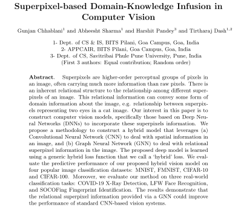

# Superpixels
In this work, we demonstrate that infusing domain knowledge in the form of superpixels-based radial graph improves the predictive performance of CNN-based classifiers. We would love to know about any issues found on this repository. Please create an issue for any queries, or contact us at sharmabhee@gmail.com.

[Paper](https://dl.acm.org/doi/10.1145/3476883.3520216)
[arXiv](https://arxiv.org/abs/2105.09448)


## Abstract

<p align="center">
  
</p>

## Updates

- [4 May 2022]: Paper accepted at ACM SE '22 (best short paper award)!
- [18 May 2021]: Repository is made public.

## Directory Structure

You can find the structure of the repository (i.e., the sub-directories and files) [here](misc/DIRSTRUCTURE.md).

## Usage

### Quick Colab Guide

[Colab Notebook](https://colab.research.google.com/drive/1zpgNTe1B_RqPzqVPwxwyia8DOPQfnBv2?usp=sharing)

### Setting Up

Clone the repository.

```sh
git clone https://github.com/abheesht17/super-pixels.git
cd super-pixels
```

Install the requirements.

```sh
make requirements
```
At times, especially on Colab, the above command fails. It is preferable that you run the following:

```sh
pip3 install --upgrade -r requirements.txt --find-links https://pytorch-geometric.com/whl/torch-1.8.0+cu101.html --find-links https://download.pytorch.org/whl/torch_stable.html
```

Note: Find the CUDA version and install accordingly. 

### Datasets

All the datasets are available on [Google Drive](https://drive.google.com/drive/u/0/folders/1CQfPgNtXmRzUqYrz5eFZDwHgW1crbje-).

#### List of available datasets:
- [MNIST](http://yann.lecun.com/exdb/mnist/)
- [FashionMNIST](https://github.com/zalandoresearch/fashion-mnist)
- [CIFAR-10](https://www.cs.toronto.edu/~kriz/cifar.html)
- [CIFAR-100](https://www.cs.toronto.edu/~kriz/cifar.html)
- [COVID X-Ray Detection](https://github.com/tawsifur/COVID-19-Chest-X-ray-Detection)
- [LFW Face Recognition](http://vis-www.cs.umass.edu/lfw/)
- [SOCOFing Fingerprint Identification](https://www.kaggle.com/ruizgara/socofing)


### Grid Search

For all models and datasets, the configs are present in the `configs/custom_trainer` directory. Choose a config according to the model and the dataset you want to run. For example, to do a Grid Search on the CNN+GAT model using the LFW dataset, you have to run the following command:

```sh
python train.py --config_dir ./configs/custom_trainer/graph_image/hybrid/cnn_gat_lfw --grid_search --validation
```

Currently, we guarantee that the "cnn" and "cnn_gat" models are in working condition. The rest have to be checked.

This will save the logs and the final model at the path specified in the `logs` parameter. The default is the `logs/<model_dataset_name>` folder.

Note: Performing Grid Search is not necessary. The default hyperparameters specified in the configs are the ones obtained after performing Grid Search; one can directly run the training and inference command given in the next subsection.  

### Training and Inference

```sh
python train.py --config_dir ./configs/custom_trainer/graph_image/hybrid/cnn_gat_lfw
```
## Tasks

- [x] Add Usage.
- [x] Add Citation(s).
- [x] Update `README.md`.
- [x] Add Directory Structure.

## Results and Analysis

### Results on Standard Datasets

|  Dataset  |   CNN  | CNN+GNN |
|:---------:|:------:|:-------:|
|   MNIST   | 99.30% |  99.21% |
|   FMNIST  | 91.65% |  91.50% |
|  CIFAR-10 | 77.80% |  76.81% |
| CIFAR-100 | 42.88% |  46.79% |

### Results on Domain-Specific Datasets

|  Dataset |   CNN  | CNN+GNN |
|:--------:|:------:|:-------:|
|   COVID  | 89.09% |  91.01% |
|    LFW   | 60.83% |  66.12% |
| SOCOFing | 65.68% |  93.58% |

## Citation

Our paper was accepted at ACM SE '22!

You can cite our work as:

```
@inproceedings{10.1145/3476883.3520216,
author = {Chhablani, Gunjan and Sharma, Abheesht and Pandey, Harshit and Dash, Tirtharaj},
title = {Superpixel-Based Knowledge Infusion in Deep Neural Networks for Image Classification},
year = {2022},
isbn = {9781450386975},
publisher = {Association for Computing Machinery},
address = {New York, NY, USA},
url = {https://doi.org/10.1145/3476883.3520216},
doi = {10.1145/3476883.3520216},
abstract = {Superpixels are higher-order perceptual groups of pixels in an image, often carrying much more information than the raw pixels. There is an inherent relational structure to the relationship among different superpixels of an image such as adjacent superpixels are neighbours of each other. Our interest here is to treat these relative positions of various superpixels as relational information of an image. This relational information can convey higher-order spatial information about the image, such as the relationship between superpixels representing two eyes in an image of a cat. That is, the two eyes are placed adjacent to each other in a straight line or the mouth is below the nose. Our motive in this paper is to assist computer vision models, specifically those based on Deep Neural Networks (DNNs), by incorporating this higher-order information from superpixels. We construct a hybrid model that leverages (a) Convolutional Neural Network (CNN) to deal with spatial information in an image and (b) Graph Neural Network (GNN) to deal with relational superpixel information in the image. The proposed model is learned using a generic hybrid loss function. Our experiments are extensive, and we evaluate the predictive performance of our proposed hybrid vision model on seven different image classification datasets from a variety of domains such as digit and object recognition, biometrics, medical imaging. The results demonstrate that the relational superpixel information processed by a GNN can improve the performance of a standard CNN-based vision system.},
booktitle = {Proceedings of the 2022 ACM Southeast Conference},
pages = {243–247},
numpages = {5},
keywords = {SLIC, superpixels, convolutional neural networks, knowledge-infused learning, graph neural networks},
location = {Virtual Event},
series = {ACM SE '22}
}
```

If you use any part of our code in your work, please use the following citation:

```
@misc{sharma2021superpixelsgithub,
  author = {Abheesht Sharma and Gunjan Chhablani and Harshit Pandey and Tirtharaj Dash},
  title = {abheesht17/super-pixels},
  year = {2021},
  publisher = {GitHub},
  journal = {GitHub repository},
  howpublished = {\url{https://github.com/abheesht17/super-pixels}},
}
```
