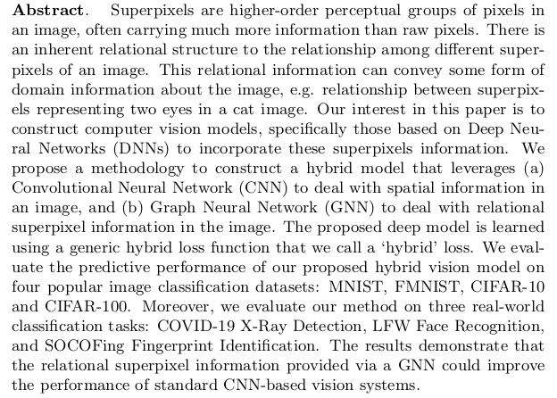

# Superpixels
In this work, we demonstrate that infusing domain knowledge in the form of superpixels-based radial graph improves the predictive performance of CNN-based classifiers. We would love to know about any issues found on this repository. Please create an issue for any queries, or contact us at sharmabhee@gmail.com.

Pre-print: Coming Soon

## Abstract

<p align="center">
  
</p>

## Updates

- [18 May 2021]: Repository is made public.

## Usage

### Quick Colab Guide

[Colab Notebook](https://colab.research.google.com/drive/1zpgNTe1B_RqPzqVPwxwyia8DOPQfnBv2?usp=sharing)

### Setting Up

Clone the repository.

```sh
git clone https://github.com/abheesht17/super-pixels.git
cd super-pixels
```

Install the requirements.

```sh
make requirements
```
At times, especially on Colab, the above command fails. It is preferable that you run the following:

```sh
pip3 install --upgrade -r requirements.txt --find-links https://pytorch-geometric.com/whl/torch-1.8.0+cu101.html --find-links https://download.pytorch.org/whl/torch_stable.html
```

Note: Find the CUDA version and install accordingly. 

### Datasets

All the datasets are available on [Google Drive](https://drive.google.com/drive/u/0/folders/1CQfPgNtXmRzUqYrz5eFZDwHgW1crbje-).

#### List of available datasets:
- [MNIST](http://yann.lecun.com/exdb/mnist/)
- [FashionMNIST](https://github.com/zalandoresearch/fashion-mnist)
- [CIFAR-10](https://www.cs.toronto.edu/~kriz/cifar.html)
- [CIFAR-100](https://www.cs.toronto.edu/~kriz/cifar.html)
- [COVID X-Ray Detection](https://github.com/tawsifur/COVID-19-Chest-X-ray-Detection)
- [LFW Face Recognition](http://vis-www.cs.umass.edu/lfw/)
- [SOCOFing Fingerprint Identification](https://www.kaggle.com/ruizgara/socofing)


### Grid Search

For all models and datasets, the configs are present in the `configs/custom_trainer` directory. Choose a config according to the model and the dataset you want to run. For example, to do a Grid Search on the CNN+GAT model using the LFW dataset, you have to run the following command:

```sh
python train.py --config_dir ./configs/custom_trainer/graph_image/hybrid/cnn_gat_lfw --grid_search --validation
```

Currently, we guarantee that the "cnn" and "cnn_gat" models are in working condition. The rest have to be checked.

This will save the logs and the final model at the path specified in the `logs` folder.

### Training and Inference

```sh
python train.py --config_dir ./configs/custom_trainer/graph_image/hybrid/cnn_gat_lfw
```
## Tasks

### Done

- [x] Add Usage.
- [x] Add Citation(s).
- [x] Update `README.md`.

### Ongoing

- [ ] Add Directory Structure.


## Results and Analysis

### Results on Standard Datasets

|  Dataset  |   CNN  | CNN+GNN |
|:---------:|:------:|:-------:|
|   MNIST   | 99.30% |  99.21% |
|   FMNIST  | 91.65% |  91.50% |
|  CIFAR-10 | 77.80% |  76.81% |
| CIFAR-100 | 42.88% |  46.79% |

### Results on Domain-Specific Datasets

|  Dataset |   CNN  | CNN+GNN |
|:--------:|:------:|:-------:|
|   COVID  | 89.09% |  91.01% |
|    LFW   | 60.83% |  66.12% |
| SOCOFing | 65.68% |  93.58% |

## Citation

You can cite our work as:

```sh
@unpublished{chhablani2021superpixels ,
author = {Gunjan Chhablani and Abheesht Sharma and Harshit Pandey and Tirtharaj Dash},
title = {Superpixel-based Domain-Knowledge Infusion in Computer Vision},
note = {Under Review at ESANN '21},
year = {2021}
}
```
OR

```sh
G. Chhablani, A. Sharma, H. Pandey, T. Dash, "Superpixel-based Domain-Knowledge Infusion in Computer Vision", Under Review at ESANN '21, 2021.
```

If you use any part of our code in your work, please use the following citation:

```sh
@misc{sharma2021superpixelsgithub,
  author = {Abheesht Sharma and Gunjan Chhablani and Harshit Pandey and Tirtharaj Dash},
  title = {abheesht17/super-pixels},
  year = {2021},
  publisher = {GitHub},
  journal = {GitHub repository},
  howpublished = {\url{https://github.com/abheesht17/super-pixels}},
}
```